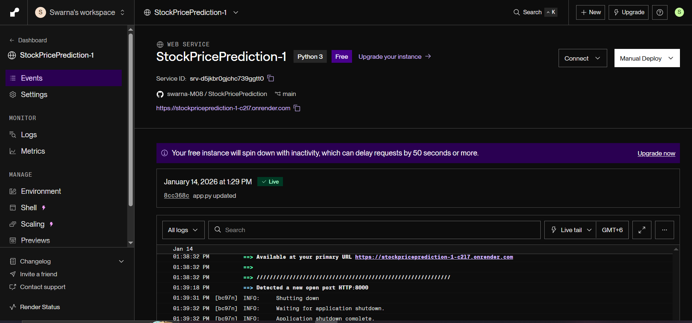
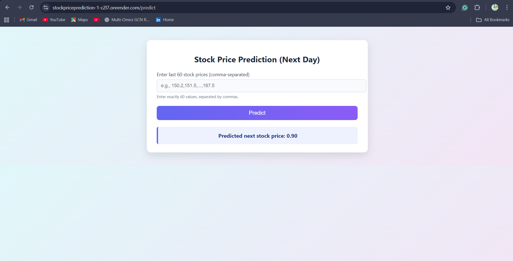

# Stock Price Prediction using LSTM (Time Series Forecasting)

## Project Overview
This project predicts the future stock prices of Apple Inc. (AAPL) using a **Long Short-Term Memory (LSTM) neural network**, a type of recurrent neural network suitable for **time series forecasting**.  
The project includes:

- Historical stock price analysis
- Advanced visualizations (trend, volatility, confidence band)
- Next 7 days stock price prediction
- Model deployment-ready using **FastAPI** and **Docker**
- Model Deployed on Render

---

## Features

- **Data Source:** Historical stock price CSV (`aapl_ticker.csv`)
- **Model:** LSTM neural network
- **Time Window:** 60 days sequence for training
- **Predictions:**
  - Next-day prediction
  - Next 7 days prediction
- **Visualization:**
  - Closing price trend
  - 20-day rolling volatility
  - Actual vs Predicted prices with 95% confidence band
  - Training vs Validation loss
- **Deployment-ready:** `lstm_model.h5` + `scaler.pkl` compatible with FastAPI and Docker

---


Create a new environment 
```
conda create -p venv python==3.10 -y

```

**Render Live Deployment**

Live App:[Click here to access the live app](https://stockpriceprediction-1-c2l7.onrender.com)


📸 **Application Screenshots**

Live Deployment :



Web Application



